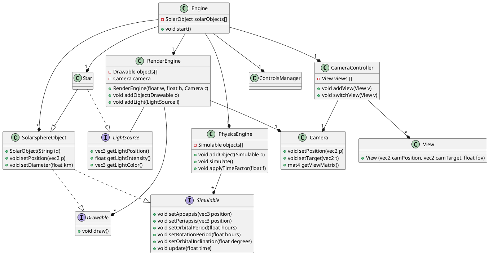

# SolarSystemOpenGL

## Architecture

```plantuml
@startuml
SolarSphereObject ..|> Drawable
SolarSphereObject ..|> Simulable
Star ..|> LightSource
Star --|> SolarSphereObject 
RenderEngine --* "*" Drawable
RenderEngine -- LightSource
PhysicsEngine --* "*" Simulable
Engine --* "*" SolarSphereObject 
Engine --* "1" Star
Engine --* "1" RenderEngine
Engine --* "1" PhysicsEngine
Engine --* "1" ControlsManager
Engine --* "1" CameraController
CameraController --* "1" Camera
RenderEngine --* "1" Camera
CameraController --* "*" View


class Engine {
-SolarObject solarObjects[]
+void start()
}

class View {
+View (vec2 camPosition, vec2 camTarget, float fov)
}

class CameraController {
-View views []
+void addView(View v)
+void switchView(View v)
}

class Camera {
+void setPosition(vec2 p)
+void setTarget(vec2 t)
+mat4 getViewMatrix()
}

class RenderEngine {
-Drawable objects[]
-Camera camera
+RenderEngine(float w, float h, Camera c)
+void addObject(Drawable o)
+void addLight(LightSource l)
}

class PhysicsEngine {
-Simulable objects[]
+void addObject(Simulable o)
+void simulate()
+void applyTimeFactor(float f)
}

class ControlsManager {
}

interface Drawable {
+void draw()
}

class SolarSphereObject {
+SolarObject(String id)
+void setPosition(vec2 p)
+void setDiameter(float km)
}

class Star {
}

interface Simulable {
+void setApoapsis(vec3 position)
+void setPeriapsis(vec3 position)
+void setOrbitalPeriod(float hours)
+void setRotationPeriod(float hours)
+void setOrbitalInclination(float degrees)
+void update(float time)
}

interface LightSource {
+vec3 getLightPosition()
+float getLightIntensity()
+vec3 getLightColor()
}
@enduml
```